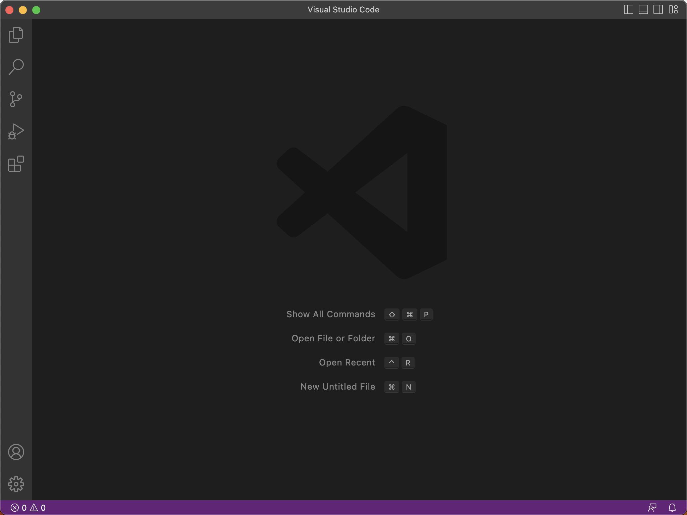
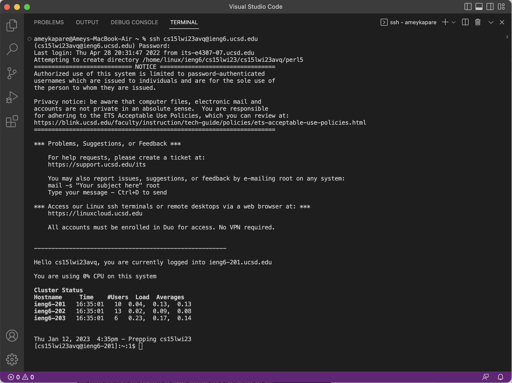
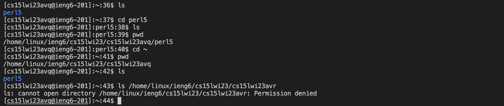

# **Lab Report 1**

Step 1: Installing VSCode

[Link to the VSCode download page](https://code.visualstudio.com)

VSCode is a code editor which is fast, and also versatile since it works with many languages and contains an in-built terminal!

After downloading VSCode, the front screen should look something like this:

---
Step 2: Remotely Connecting

Now, I had to first log into my UCSD password manager tool given on the Lab 1 website to change the password of my temporary course-specific account for CSE 15L to access the remote server. After changing my password, and logging in successfully with the new password, it shows the above screen with the CPU, cluster status, useful links, terms and conditions, and disclaimer displayed after the login message.

---
Step 3: Trying Some Commands

I have tried a variety of commands including ls, which displays the list of current items, and cd, which changes the directory to a different folder. I also used pwd as needed to check my current directory for eased file navigation, and when I tried to access a different user's home directory, the remote server's security settings denied me access.

After running these commands, I have learned that switching between different files is very easy since it simply uses cd and the filepath for the destination. I also noticed that some commands which involve only internal operations do not produce output like cd. However, commands which are supposed to interact with the user like ls, which conveys a list of all files in the directory, produce output for the user.