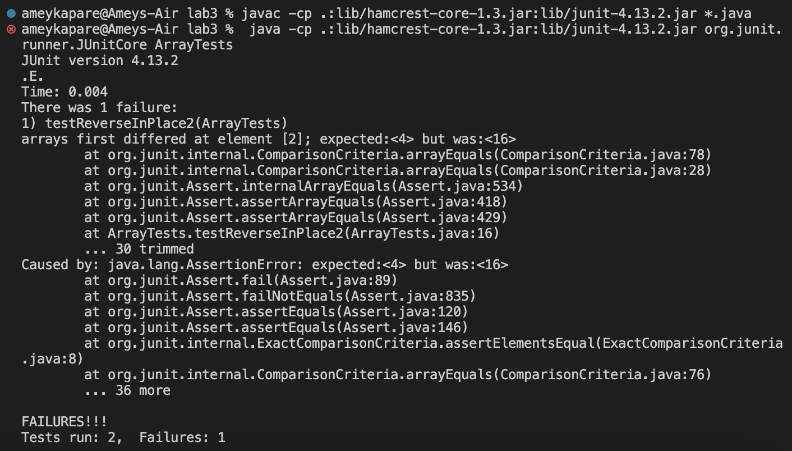

# **Lab Report 2**

Part 1:

The following block of code is used to create a StringServer:

```java
import java.io.IOException;
import java.net.URI;

class Handler implements URLHandler {
    // The one bit of state on the server: a string that will be manipulated by various requests.
    String text = "";
    
    public String handleRequest(URI url) {
        if (url.getPath().equals("/")) {
            return text;
        } else if (url.getPath().contains("add-message")) {
            String[] parameters = url.getQuery().split("=");
            if (parameters[0].equals("s")) {
                text += parameters[1];
                text += "\n";
            }
            return text;
        } else if (url.getQuery().contains(" ")) {
            return text;
        } else {
            return "404 Not Found!";
        }
    }
}

class StringServer {
    public static void main(String[] args) throws IOException {
        if (args.length == 0) {
            System.out.println("Missing port number! Try any number between 1024 to 49151");
            return;
        }

        int port = Integer.parseInt(args[0]);

        Server.start(port, new Handler());
    }
}
```

Below is a screenshot depicting the usage of /add-message on the server:


Here, the handleRequest method from the Handler class is called with the inputted URL as a parameter. Since the query of the input is s=Hello, the code splits the string across the = into two strings stored in a two-string array, and the value of the second string (on the right side of the = sign) was concatenated with the text string and appended with a newline character, effectively changing its value before being outputted onto the web page. The other values remain unchanged, and the main method from the StringServer class is called from the terminal to either start the server, or to prompt user to enter a valid port number.

Below is another screenshot depicting the usage of /add-message on the server:


Similar to the earlier screenshot, the handleRequest method from the Handler class is called with the inputted URL as a parameter, except with a different query of s=How are you. Following the earlier process, the substring on the right side of the = sign, "How are you", was concatenated onto the text string and appended with newline character before being outputted onto the web page. Just like the previous iteratino, the other values remain unchanged, and the main method from the StringServer class is called from the terminal to either start the server, or to prompt user to enter a valid port number.

---
Part 2:

I am choosing the bug in the reverseInPlace() method of the ArrayExamples to do its analysis of inputs that cause the method to either succeed or fail its JUnit tests.

The input {4, 8, 16} causes the method to fail the JUnit test:

```java
@Test
public void testReverseInPlace()    {
    int[] input = {4, 8, 16};
    ArrayExamples.reverseInPlace(input);
    assertArrayEquals(new int[]{16, 8, 4}, input2);
}
```

An input of a single-element array containing the integer 3, on the other hand, passes the JUnit test:

```java
@Test
public void testReverseInPlace()    {
    int[] input1 = {3};
    ArrayExamples.reverseInPlace(input1);
    assertArrayEquals(new int[]{3}, input1);
}
```

The two tests formed the following symptoms. As it is shown, the test with an input of a three-element array has failed, whereas the other test successfully passed:



The bug, as the before-and-after code blocks with the necessary fixes incorporated into the debugged code block:

```java
// Changes the input array to be in reversed order - BUGGY
static void reverseInPlace(int[] arr)   {
    for(int i = 0; i < arr.length; i += 1)  {
        arr[i] = arr[arr.length - i - 1];
    }
}

// Changes the input array to be in reversed order - DEBUGGED
static void reverseInPlace(int[] arr)   {
    for (int i = 0; i < arr.length/2; i += 1)   {
        int temp = arr[i];
        arr[i] = arr[arr.length - i - 1];
        arr[arr.length - i - 1] = temp;
    }
}
```

As it is shown, the fix addresses the issue because in the buggy method, the value being replaced is lost and not saved into a different variable so that it can be used for later. Also, only half of the array should be traversed, since the first and last array elements are modified in very iteration, until the pointer reaches the midpoint.

---
Part 3:

During Week 3, I was able to learn how to create a server, as well as use the terminal to run JUnit tests. I think this was a crucial skill that allows for testing Java code without needing the aid of an external IDE. I also think that the server exercise taught how to create a website which generates different output based on different URL queries!