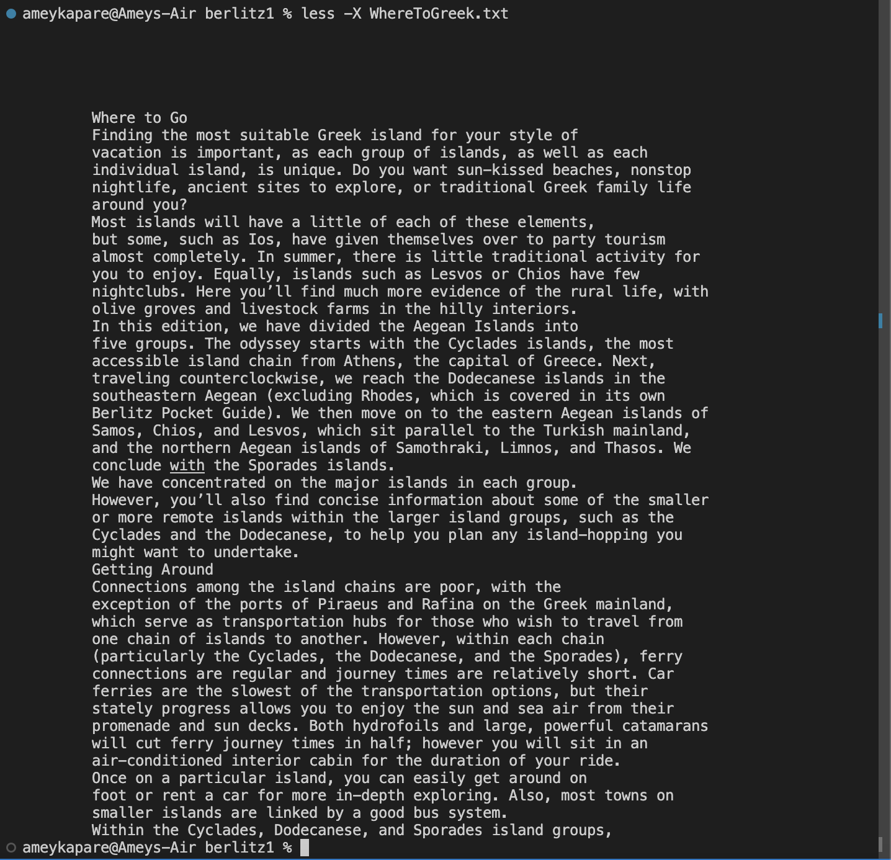

# **Lab Report 3**

I researched four different options for the less command, and provided examples of each performed on files in the ./written_2 directory.

---
The first option I chose is less -i followed by filename. An example of this is depicted below:

Here, the -i ensures that all cases of the inputted file IntroIndia.txt are valid to be opened and outputted.

A second example of command option -i is depicted below:

Here, the -i ensures that all cases of the inputted file, such as introiTALy.txt, such as the file IntroItaly.txt, are also valid to be opened and outputted.

---
The second option I chose is less -N followed by filename. An example of this is depicted below:

Here, the -N ensures that the inputted file HandRLasVegas.txt is opened with line numbers labeled at each line.

A second example of command option -N is depicted below:

Here, the -N ensures that the inputted file HandRLosAngeles.txt is opened with line numbers labeled at each line.

---
The third option I chose is less -s followed by filename. An example of this is depicted below:

Here, the -s ensures that the inputted file HistoryDublin.txt is opened with all instances of multiple consecutive blank lines merged into a single line.

A second example of this command option is depicted below:

Here, the -s ensures that the inputted file HistoryEdinburgh.txt is opened with all instances of multiple consecutive blank lines merged into a single line.

The fourth option I chose is less -X followed by filename. An example of this is depicted below:

Here, the -X ensures that the contents of the inputted file WhatToFrance.txt are saved onto the terminal window even after exiting the file and returning to the command line.

A second example of this command option is depicted below:

Here, the -X ensures that the contents of the inputted file WhatToGreek.txt are saved onto the terminal window even after exiting the file and returning to the command line.

---
For my research on all of those four command-line options for less, I referred to the website https://phoenixnap.com/kb/less-command-in-linux.