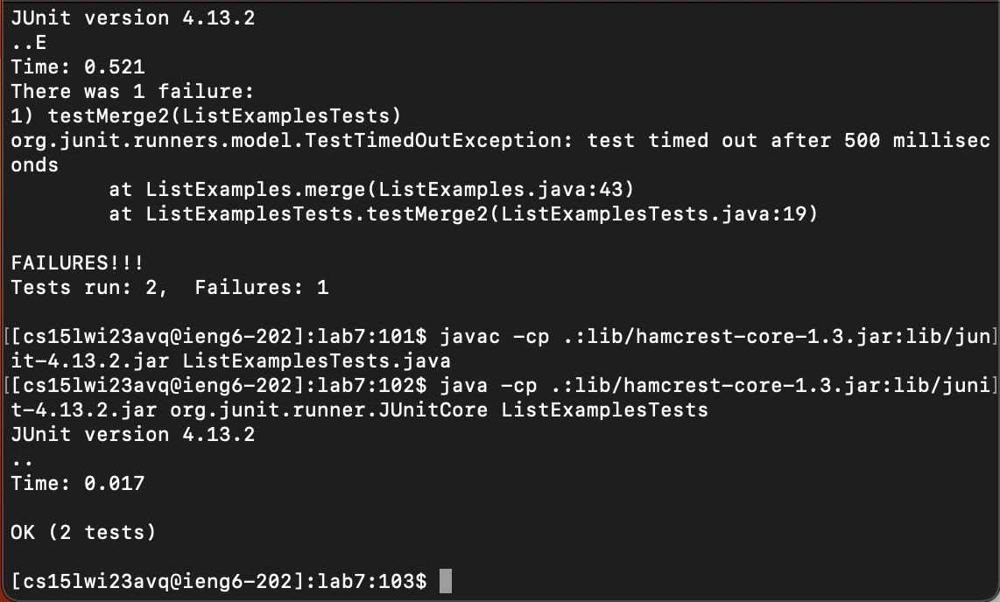

# **Lab Report 4**

The following are steps 4-9 from the in-lab competition.

---
Step 4: Log into ieng6

I simply typed ssh along with my username before hitting the return key.

---
Step 5: Clone your fork of the repository from your Github account

I simply used the git clone command and pasted the URL of the repository which I wanted to clone before hitting the return key. I then used ls to verify that the clone was successful.

---
Step 6: Run the tests, demonstrating that they fail

I typed the java compilation line before hitting the return key. Then I typed the java runtime line before hitting the return key once again, to generate the tests which indicate that there is a bug on line 43 of ListExamples.java.

---
Step 7: Edit the code file to fix the failing test

For editing the code, I used the vi command on the buggy Java file and hit the <i> key to enter editing mode. Since the cursor was at the bottom of the file (line 49), I had to type the <up> key six times to reach the buggy line 43, and then <right> key twelve times to reach the cursor at the debug point. Then, I simply changed the variable name and hit the <escape> key, then <:w> and <:q> to save the changes and qui out of the editor, respectively.

---
Step 8: Run the tests, demonstrating that they now succeed

I hit the <up> key twice to reach the compilation command, compiled, then pressed the <down> key once to run, and get the message showing that the bug is fixed!

---
Step 9: Commit and push the resulting change to your Github account (you can pick any commit message!)

I simply used the git commit command for this step, and added the message which shows what I changed!