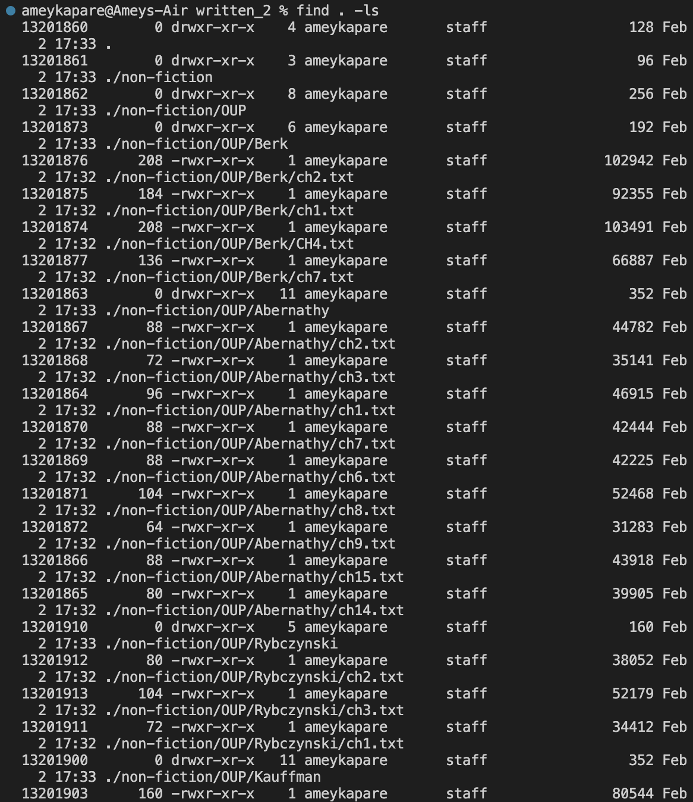

# **Lab Report 5**

For my final lab report, I researched four different options for the find command, and provided examples of each performed on files in the ./written_2 directory.

---
The first option I chose is find . -name followed by a string to be searched for. Two example of these are depicted below:

In both of the above examples, the . -name ensures that the inputted string is searched in the current directory.

---
The second option I chose is find . -iname followed by a string to be searched for. Two examples of these are depicted below: 

In both of the above examples, the . -iname ensures that the inputted string is searched as an approximate name, doing partial and case insensitive name searches in the current directory. 

---
The third option I chose is find . -type followed by a letter representing the type of files to be searched. Two example of these are depicted below:

In both of the above examples, the . -type gives choices, like . -type f will search only files in the current directory, whereas . -type d will do the same but for directories.

---
The fourth option I chose is find . -ls. An example of this is depicted below:

Here, the . -ls lists all the files inside the current directory, along with their detailed attributes.

---
For my research on all of those four command-line options for find, I referred to only one website, with its link below.

[Source](https://www.redhat.com/sysadmin/linux-find-command)